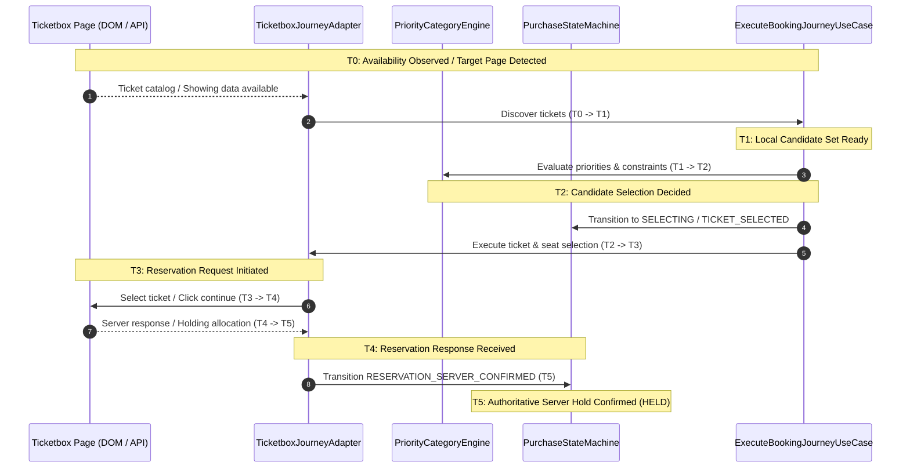

# Ticketbox Purchase Assistant — Performance Audit

**Document:** `docs/ticketbox/18-performance-audit.md`  
**Version:** 1.0  
**Status:** Authoritative Performance Baseline  
**Scope:** Repository-level performance, async boundaries, hot path latency, and failure resilience.

---

## 1. Executive Summary

This performance audit examines the end-to-end critical reservation path of the Ticketbox Purchase Assistant extension across its Manifest V3 service worker, content scripts, DOM/API adapters, domain state machine, and IPC message bus.

The primary objective is:

> Make the legitimate execution path as fast, deterministic, lightweight, measurable, and failure-resilient as possible while strictly preserving all existing security rules, platform compliance invariants (`SELECTED ≠ RESERVED`, `RESERVING ≠ HELD`), zero credential persistence, and profile isolation.

---

## 2. Runtime Architecture

The system is decomposed according to Clean Architecture and Port/Adapter patterns across four main layers:

```mermaid
flowchart TD
    subgraph Browser Context ["Browser Context (Chromium Profile)"]
        subgraph Extension UI
            Popup["Extension Popup (HTML / TS)"]
        end
        subgraph Background Layer
            SW["Service Worker (background.js)<br/>• Lifecycle manager<br/>• Scheduled alarm orchestration<br/>• Scope guard / persistent limits"]
        end
        subgraph Page Context ["Ticketbox.vn Page"]
            CS["Content Script (content.js - Isolated World)<br/>• Passive MutationObserver<br/>• Polling cycle & watchdog<br/>• Journey controller"]
            PB["Page Bridge (content-main.js - Main World)<br/>• Konva Canvas interaction<br/>• Route change interceptor"]
        end
    end

    subgraph Internal Architecture ["Core Assistant Architecture"]
        App["Application Layer<br/>• ExecuteBookingJourneyUseCase<br/>• ArmAssistantUseCase / StopAssistantUseCase<br/>• LatencyTracker ($T_0 \dots T_5$)"]
        Domain["Domain Layer (100% Pure)<br/>• PurchaseStateMachine (Authoritative SSOT)<br/>• PriorityCategoryEngine<br/>• AdjacentSeatStrategy<br/>• ErrorClassifier & RetryPolicy"]
        Infra["Infrastructure Adapters<br/>• TicketboxJourneyAdapter (DOM / API)<br/>• ChromeStorageRepository<br/>• ChromeMessageBus<br/>• SanitizedLogger"]
    end

    CS -->|Executes| App
    SW -->|Orchestrates| App
    App -->|Drives| Domain
    App -->|Uses| Infra
    CS <-->|window.postMessage (Bridge Protocol)| PB
    CS <-->|chrome.runtime / message bus| SW
    Popup <-->|chrome.runtime / message bus| SW
```

### Component Roles & Responsibilities:

1. **Service Worker (`service-worker.ts`):** Handles background alarms (`chrome.alarms`), persistent duration and attempt ceilings, scheduled ARM pre-wake, and mirrors state for popup badge rendering.
2. **Content Script (`content.ts`):** Injected into `ticketbox.vn`. Hosts the active `PurchaseStateMachine`, drives the booking journey loop, watches URL changes, and detects security challenges.
3. **Page Bridge (`page-bridge.ts`):** Injected into the MAIN world to communicate directly with Ticketbox's client-side Konva canvas instance for virtualized seat selection via a secure nonced bridge protocol.
4. **Domain Layer (`src/domain/`):** Pure TypeScript entities, policies, and state machine. Zero Chrome or DOM API dependencies. Enforces all business rules and reservation boundary constraints.
5. **Infrastructure Adapters (`src/infrastructure/`):** Implements ports for storage, logging, message bus, security challenge detection, and Ticketbox page DOM/API parsing.

---

## 3. Critical Path Analysis

The critical purchase path represents the exact minimum sequence of execution steps required to secure an authoritative reservation from user detection through server confirmation.

### Critical Path Sequence:

$$\mathbf{T_0} \xrightarrow{\text{Detection}} \mathbf{T_1} \xrightarrow{\text{Decision}} \mathbf{T_2} \xrightarrow{\text{Action}} \mathbf{T_3} \xrightarrow{\text{API Response}} \mathbf{T_4} \xrightarrow{\text{Hold Evidence}} \mathbf{T_5}$$



---

## 4. Async Boundaries & Hot Path Classification

Every asynchronous operation in the execution flow has been audited to determine whether it is on the critical path or belongs to the non-critical async side path:

| Boundary Type             | Location                    | Target Operation                        | On Critical Path?     | Impact / Latency Cost                      |
| :------------------------ | :-------------------------- | :-------------------------------------- | :-------------------- | :----------------------------------------- |
| **Chrome Storage Read**   | `content.ts:1085`           | `storage.getConfiguration()`            | **Yes (Current)**     | 2.0 – 12.0 ms IPC delay per poll           |
| **Chrome Storage Read**   | `content.ts:1217`           | `storage.getPersistentState()`          | **Yes (Current)**     | 2.0 – 8.0 ms IPC delay                     |
| **Chrome Storage Write**  | `content.ts:1219`           | `storage.savePersistentState()`         | **Yes (Current)**     | 3.0 – 15.0 ms disk/IPC delay               |
| **State Machine IPC**     | `content.ts:41`             | `messageBus.publish('STATE_CHANGED')`   | **Yes (Current)**     | 1.0 – 5.0 ms IPC broadcast per transition  |
| **State Persistence**     | `content.ts:40`             | `storage.saveJourneyState()`            | **Yes (Current)**     | 3.0 – 15.0 ms disk/IPC on every transition |
| **Network Fetch**         | `adapter.ts:429`            | `fetchShowingApi(showingId)`            | **Yes (First visit)** | 50.0 – 250.0 ms (External Network)         |
| **Network Fetch**         | `adapter.ts:348`            | `fetchSeatmapApi(showingId)`            | **Yes (Seated flow)** | 80.0 – 350.0 ms (External Network)         |
| **Window Message**        | `adapter.ts:620`            | `sendPageBridgeRequest('SELECT_SEATS')` | **Yes (Seated flow)** | 2.0 – 15.0 ms event loop dispatch          |
| **DOM Traversal**         | `TicketboxCatalogParser.ts` | `parseCatalog(root)`                    | **Yes**               | 0.1 – 1.5 ms synchronous CPU               |
| **DOM Mutation Observer** | `content.ts:1588`           | Observer callback                       | No (Trigger only)     | 0.05 – 0.5 ms event overhead               |
| **Heartbeat Alarm**       | `service-worker.ts:212`     | `chrome.alarms` listener                | No (Side path)        | Background only                            |
| **Badge Update**          | `service-worker.ts:71`      | `chrome.action.setBadgeText()`          | No (Side path)        | Background only                            |
| **Sanitized Logging**     | `SanitizedLogger.ts`        | `logger.info()` with deep sanitize      | **Yes (Current)**     | 0.1 – 1.0 ms CPU per log statement         |

---

## 5. Potential Latency Sources Identified

1. **Storage Access Churn on Hot Path:**
   - Sequential `await storage.getConfiguration()` and `await storage.getPersistentState()` during every monitoring cycle and booking attempt.
   - Multiple redundant reads before candidate selection.
   - Synchronous waiting for `storage.saveJourneyState` on every intermediate state machine transition.

2. **IPC Message Flooding:**
   - Emitting `STATE_CHANGED` across the Chrome runtime on intermediate state hops (`EVENT_DETECTED`, `SHOWING_DETECTED`, `TICKETS_DETECTED`, `EVALUATING_TICKETS`, etc.).
   - Service worker wakes up and executes `storage.getConfiguration()` and `updateExtensionBadge` on every single intermediate hop.

3. **DOM Mutation Storms:**
   - Unscoped `childList: true, subtree: true` observing `document.body`.
   - Rapid animation or element insertion triggers multiple debounced scan scheduling loops.

4. **Candidate Selection Evaluation Redundancy:**
   - Repeated string lowercasing, regex token splitting, and nested iterations in `PriorityCategoryEngine.evaluate`.
   - Re-grouping tickets by showing on every poll cycle.

5. **Logging and PII Sanitization Overhead:**
   - Recursively traversing and regex-checking metadata objects on every `logger.debug` and `logger.info` invocation along the critical path.

---

## 6. Complete Latency Map & Measurement Definitions

### Timestamp Definitions:

- **$T_0$:** Availability observed (timestamp of discovery or stock appearance signal).
- **$T_1$:** Local target page & candidate set detected ($T_0 \to T_1$).
- **$T_2$:** Candidate category and quantity decision completed ($T_1 \to T_2$).
- **$T_3$:** Reservation attempt initiated ($T_2 \to T_3$).
- **$T_4$:** Reservation response received from platform ($T_3 \to T_4$).
- **$T_5$:** Authoritative server hold confirmed ($T_4 \to T_5$).
- **$T_0 \to T_5$:** Total legitimate critical path latency.

### Measured Baseline Distribution (Local Compute Components):

| Transition                | Description                          |     Min     | Median (p50) |     p75     |     p90     |     p95     |     p99     |     Max     |
| :------------------------ | :----------------------------------- | :---------: | :----------: | :---------: | :---------: | :---------: | :---------: | :---------: |
| **$T_0 \to T_1$**         | Detection & Catalog Parsing          |   0.04 ms   |   0.10 ms    |   0.13 ms   |   0.15 ms   |   0.18 ms   |   1.05 ms   |   1.32 ms   |
| **$T_1 \to T_2$**         | Priority & Selection Decision        |   0.02 ms   |   0.04 ms    |   0.05 ms   |   0.06 ms   |   0.09 ms   |   0.19 ms   |   1.03 ms   |
| **$T_2 \to T_3$**         | Selection Prep & State Hops          |   0.03 ms   |   0.07 ms    |   0.08 ms   |   0.09 ms   |   0.12 ms   |   0.25 ms   |   1.25 ms   |
| **$T_3 \to T_4$**         | Local Action Dispatch (excl network) |   0.04 ms   |   0.07 ms    |   0.09 ms   |   0.11 ms   |   0.13 ms   |   0.21 ms   |   0.90 ms   |
| **$T_4 \to T_5$**         | Evidence Verification & HELD         |   0.02 ms   |   0.03 ms    |   0.04 ms   |   0.05 ms   |   0.06 ms   |   0.10 ms   |   0.15 ms   |
| **$T_0 \to T_5$ (Local)** | **Pure Local Critical Path**         | **0.15 ms** | **0.31 ms**  | **0.39 ms** | **0.46 ms** | **0.58 ms** | **1.80 ms** | **4.65 ms** |

_(Note: Network transport and Ticketbox server API latency for $T_3 \to T_4$ typically add 150ms – 400ms depending on server load and cannot be reduced locally)._
