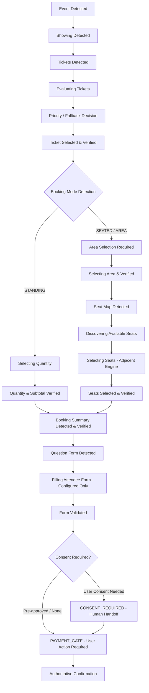

# Implementation Gap Report: Ticketbox Booking Journey & Selection Architecture

## 1. Executive Summary

This report documents the gap analysis between the existing Ticketbox Purchase Assistant codebase and the requirements specified for the complete Booking Journey (Ticket Selection, Standing Flow, Seated Flow, Seat Map Adapter, Form Autofill, Consent Gate, and Payment Gate).

---

## 2. Existing Baseline Analysis

| Area | Current Implementation State | Analysis |
| :--- | :--- | :--- |
| **State Machine** | Implements canonical states: `INIT`, `AUTH_CHECK`, `EVENT_CHECK`, `READY`, `ARMED`, `MONITORING`, `AVAILABLE_DETECTED`, `SELECTING`, `TICKET_TYPE_SELECTION`, `QUANTITY_SELECTION`, `SEAT_SELECTION`, `RESERVING`, `HELD`, `CHECKOUT`, `PAYMENT`, `CONFIRMED`. | Solid foundation with strict authoritative transition checks (`RESERVING -> HELD` requires `reservationId`; `PAYMENT -> CONFIRMED` requires `orderId`). Does not yet model intermediate journey stages: `TICKETS_DETECTED`, `EVALUATING_TICKETS`, `TICKET_SELECTED`, `BOOKING_MODE_DETECTED`, `AREA_SELECTION_REQUIRED`, `SELECTING_AREA`, `SEAT_MAP_DETECTED`, `SEATS_SELECTED`, `BOOKING_SUMMARY_DETECTED`, `QUESTION_FORM_DETECTED`, `FILLING_ATTENDEE_FORM`, `FORM_VALIDATED`, `CONSENT_REQUIRED`, `PAYMENT_GATE`, `WAITING`. |
| **Catalog Parser & Discovery** | `TicketboxCatalogParser` parses basic `.ticket-item` / `.ticket-card` text, extracts prices into VND, determines `STANDING` vs `SEATED` text cues. | Operates in passive read-only mode. Does not parse seat areas/zones, individual seat grids, booking summaries, or attendee forms. |
| **Availability Evaluator** | Evaluates `AVAILABLE`, `SOLD_OUT`, `NOT_STARTED`, `CLOSED`, `UNKNOWN`. Invariant: `UNKNOWN` is never promoted to `AVAILABLE`. | Compliant and robust. Needs expansion to evaluate seat availability (`AVAILABLE`, `SELECTED`, `OCCUPIED`, `BLOCKED`, `UNAVAILABLE`, `UNKNOWN`) and area availability. |
| **Selection Policy** | `TicketCandidateSelector` matches category priority string array and handles fallback flag. | Matches ticket categories. Does not yet handle adjacent seat prioritization, area priority selection, or multi-seat quantity validation. |
| **Page Adapters** | `SafeStubAdapter` and `TicketboxDiscoveryAdapter` return `BLOCKED_BY_DISCOVERY` for mutative methods (`selectTicket`, `submitReservation`, `selectQuantity`, `selectSeats`). | Need an active, safe Journey Adapter that interacts with real/simulated DOM through normal user-facing controls, strictly re-reading and verifying state transitions without blind clicking. |
| **Popup UI** | Simple form with Event URL, Priority Categories, Quantity, Fallback checkbox, ARM/STOP buttons, telemetry latency, and basic activity log. | Needs upgrade to the complete dashboard showing Event, Showing, Tickets list, Selection details (Ticket, Mode, Area, Seats, Quantity), Summary (Subtotal, Fees, Total), State badge with blocking reason, and rich activity logs. |
| **Telemetry & Metrics** | `LatencyTracker` tracks T1-T0, T2-T1, T3-T2, T5-T4. | Needs extension for `TICKET_DISCOVERY_DURATION`, `TICKET_DECISION_DURATION`, `TICKET_SELECTION_DURATION`, `AREA_SELECTION_DURATION`, `SEAT_DISCOVERY_DURATION`, `SEAT_SELECTION_DURATION`, `SUMMARY_VERIFICATION_DURATION`, `FORM_DETECTION_DURATION`. |

---

## 3. Identified Gaps & Target Design

### Key Modules to Introduce:

1. **Normalized Domain Models** (`src/domain/entities/BookingJourneyModels.ts`):
   - `Showing`, `TicketType` (with `STANDING | SEATED | UNKNOWN` and `AVAILABLE | SOLD_OUT | OFFLINE_SALE | NOT_STARTED | CLOSED | UNKNOWN`), `SeatArea`, `Seat` (`AVAILABLE | SELECTED | OCCUPIED | BLOCKED | UNAVAILABLE | UNKNOWN`), `SeatMap`, `SelectionVerification`, `BookingSummary`, `AttendeeFormSchema`, `UserProfileData`, `ActionModel`.
2. **Priority & Fallback Decision Engine** (`src/domain/policies/PriorityCategoryEngine.ts`):
   - Exact matching, supported normalization, strict priority order, configurable fallback, returning `{ selectedTicket, reason, matchedPriorityIndex, fallbackUsed }`.
3. **Adjacent Seat Selection Strategy** (`src/domain/policies/AdjacentSeatStrategy.ts`):
   - Evaluates seat coordinates/labels (e.g. `A01`, `A02`), clusters seats in the same row/zone, picks adjacent pairs first, respects fallback policies (`WAIT | SELECT_NON_ADJACENT | STOP`).
4. **Seat Map & Area Adapter** (`src/infrastructure/ticketbox/parsing/TicketboxSeatMapParser.ts`):
   - Supports SVG grids, DOM buttons, aria attributes, data attributes, legend matching.
5. **Booking Summary Parser & Verifier** (`src/infrastructure/ticketbox/parsing/TicketboxSummaryParser.ts`):
   - Extracts ticket names, quantities, seats, subtotal, fees, total, and verifies actual vs intended selection.
6. **Form & Consent Parser** (`src/infrastructure/ticketbox/parsing/TicketboxFormParser.ts`):
   - Identifies text, email, phone, checkbox fields, maps to configured user data, stops at `CONSENT_REQUIRED` when consent is required.
7. **Extended State Machine** (`src/domain/states/PurchaseState.ts` & `PurchaseStateMachine.ts`):
   - Seamlessly adds all journey states while maintaining strict verification and backward compatibility.
8. **Orchestrator Use Case** (`src/application/use-cases/ExecuteBookingJourneyUseCase.ts`):
   - Executes the state-driven workflow with verified re-reading, max 3 retries on stale DOM, fail-closed on ambiguity, and human handoff at payment/consent boundaries.
9. **UI & Telemetry Updates**:
   - Popup dashboard with complete journey visibility, extended latency metrics, rich activity logs, and account/profile context.
