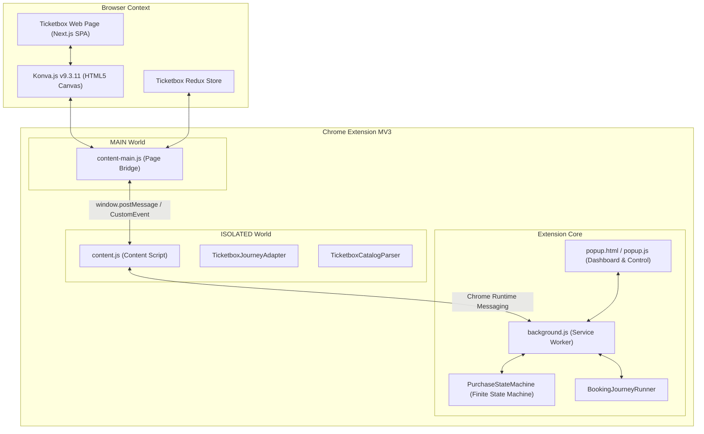
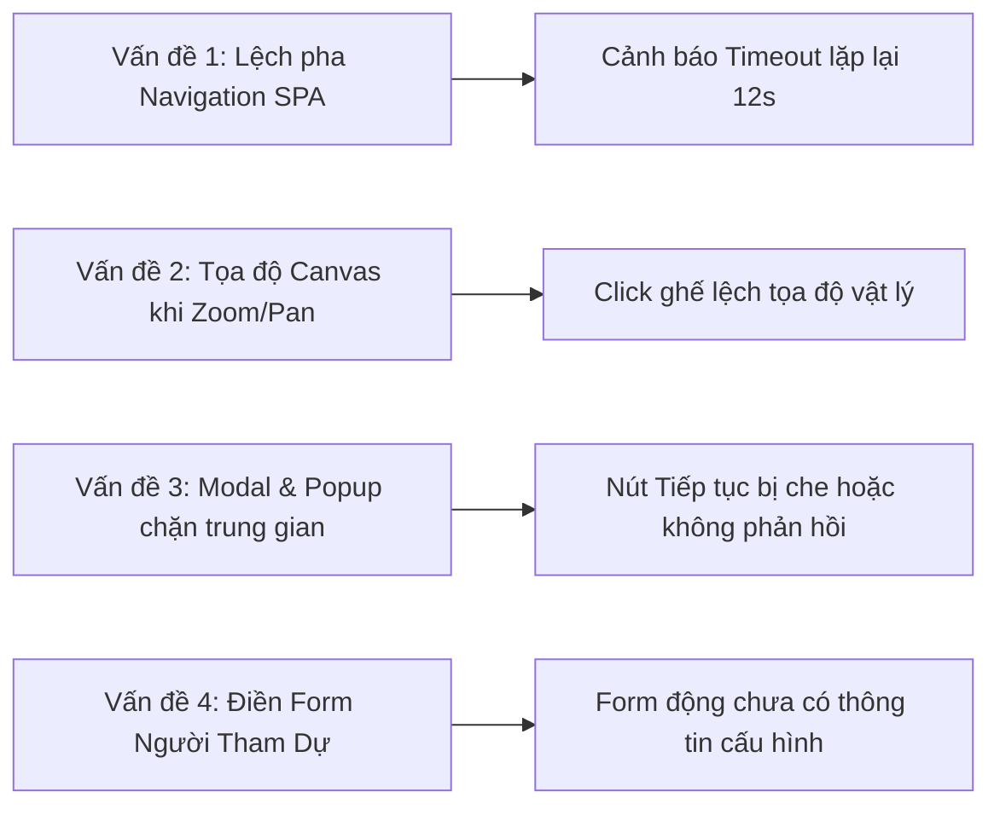

# Tổng Quan Hệ Thống: Hiện Trạng Năng Lực & Các Vấn Đề Kỹ Thuật Cần Giải Quyết

**Tài liệu:** `docs/ticketbox/20-system-status-and-open-challenges.md`  
**Dự án:** Ticketbox Purchase Assistant  
**Phiên bản hệ thống:** 0.2.0 (Phase 8 Extension Hardening)  
**Ngày cập nhật:** 29/09/2026  
**Nền tảng công nghệ:** Manifest V3 Chrome Extension, TypeScript, Vite, Konva.js (HTML5 Canvas), React / Next.js SPA.

---

## 1. Mục Đích & Triết Lý Cốt Lõi Của Hệ Thống

Ticketbox Purchase Assistant là tiện ích mở rộng trình duyệt (Chrome Extension) hỗ trợ tự động hóa luồng đặt vé trên nền tảng **Ticketbox (ticketbox.vn)**. Hệ thống được xây dựng trên triết lý **"Hỗ trợ mua vé an toàn, dựa trên bằng chứng xác thực (authoritative evidence)"**, tuyệt đối không phải là bot spam click mù quáng.

### Ranh Giới Vận Hành An Toàn (Safety Boundaries):

1. **Zero-Credential Persistence:** Tuyệt đối không lưu trữ mật khẩu, mã OTP, CVV thẻ thanh toán, cookie phiên hay token nhạy cảm vào storage.
2. **Authoritative State Transitions:** Mọi sự chuyển dịch trạng thái mua vé phải dựa trên phản hồi dữ liệu máy chủ hoặc DOM xác thực, không tự suy diễn trạng thái khi chưa có bằng chứng.
3. **Payment Gate Boundary:** Dừng lại tuyệt đối trước khâu thanh toán cuối cùng. Việc quẹt thẻ/chuyển khoản là quyết định tài chính bắt buộc do con người thực hiện.
4. **Passive-First Discovery:** Thu thập danh mục vé thụ động, không làm biến đổi (mutate) trạng thái trang khi đang trong pha dò quét.

---

## 2. Kiến Trúc Tổng Thể Đang Hoạt Động (Architecture Baseline)

Hệ thống được thiết kế theo mô hình **Clean Architecture / Domain-Driven Design (DDD)** với sự phân tách module nghiêm ngặt:

---

## 3. Những Gì Hệ Thống ĐÃ LÀM ĐƯỢC (Current Accomplishments)

### 3.1. Quản lý trạng thái bằng State Machine nghiêm ngặt

- **Hệ thống trạng thái đầy đủ (20+ States):** Quản lý chu trình sống từ `INIT`, `READY`, `ARMED`, `MONITORING`, `TICKETS_DETECTED`, `EVALUATING_TICKETS`, `TICKET_SELECTED`, `BOOKING_MODE_DETECTED`, `AREA_SELECTION_REQUIRED`, `SELECTING_AREA`, `SEAT_MAP_DETECTED`, `SEATS_SELECTED`, `BOOKING_SUMMARY_DETECTED`, `QUESTION_FORM_DETECTED`, `FILLING_ATTENDEE_FORM`, `FORM_VALIDATED`, `CONSENT_REQUIRED`, đến `PAYMENT_GATE`.
- **Khắc phục lỗi Re-entrancy:** Đã cập nhật `PurchaseStateMachine` cho phép nhận diện lại `EVENT_DETECTED`, `SEATS_SELECTED`, `QUESTION_FORM_DETECTED` từ trạng thái `TICKET_SELECTED` mà không bị văng lỗi chuyển trạng thái bất hợp lệ.

### 3.2. Thu thập thông tin danh mục vé (Catalog Discovery Engine)

- **Quét tự động & Passive:** Tự động phát hiện loại sự kiện, danh sách các hạng vé (Tiers), giá vé quy đổi VND chuẩn xác, trạng thái còn vé (`AVAILABLE`, `SOLD_OUT`, `CLOSED`).
- **Lọc ưu tiên & Fallback:** Hỗ trợ người dùng chọn thứ tự ưu tiên các hạng vé (Priority list) và cơ chế tự động chuyển sang hạng vé dự phòng nếu hạng vé ưu tiên hết chỗ.
- **Chống spam nhật ký (Deduplication):** Sử dụng cơ chế băm chữ ký (Fingerprint hashing) tại Popup UI và Content Script, loại bỏ hoàn toàn hiện tượng ghi trùng lặp 6+ log/giây khi mở tab hoặc nhận snapshot định kỳ.

### 3.3. Giải mã và điều khiển thành công Sơ đồ ghế Canvas Konva.js (Seated Flow)

- **Phân tích Decompiled Source:** Đã mổ xẻ mã nguồn Next.js bundle của Ticketbox (`chunk4146.js`, `chunk2407.js`, `chunk9243.js`), phát hiện Ticketbox không dùng DOM/SVG cho ghế mà dựng bằng **Konva.js v9.3.11** trên thẻ `<canvas>`.
- **Cơ chế 2 bước của Ticketbox:**
  1. Chế độ `p.PW.ZONE ("showMap")`: Danh sách khu vực dạng `Konva.Group`.
  2. Chế độ `p.PW.SECTION`: Khi click khu vực, Next.js gọi API `GET .../sections/{sectionId}` và chuyển sang render từng ghế `Konva.Circle` theo tọa độ `(seat.x, seat.y)`.
- **Kiến trúc Main-World Page Bridge:**
  - Xây dựng `src/extension/content/page-bridge.ts` chạy ở `"world": "MAIN"`, cho phép tương tác trực tiếp với đối tượng `window.Konva.stages`.
  - Có khả năng tìm Node khu vực, phát sự kiện click/tap để vào section.
  - Tìm ghế theo tọa độ chính xác, phát sự kiện chuột và pointer chuẩn để kích hoạt cập nhật mảng `seatsSelected` trong Redux store của Ticketbox.
  - Kích hoạt nút bấm tiếp tục ở chân trang từ trạng thái `Vui lòng chọn vé >>` sang `Tiếp tục >>`.

### 3.4. Luồng vé đứng / Chọn số lượng (Standing Flow)

- Hỗ trợ tìm stepper/input số lượng của vé đứng, tăng giảm chính xác theo số vé người dùng cấu hình trong Popup.

### 3.5. Chất lượng phần mềm & Môi trường kiểm thử

- Toàn bộ codebase được bao phủ bởi **24 test suites** và **242 unit/integration tests** với tỷ lệ pass **100%**.
- Không có bất kỳ lỗi linter (ESLint), format (Prettier), hay TypeScript typing (`tsc --noEmit`).
- Xây dựng hoàn chỉnh file build trong `dist/`: `background.js`, `content.js`, `content-main.js`, `popup.js`.

---

## 4. Các Rắc Rối & Thách Thức Đang Gặp Phải (Open Challenges)

Mặc dù nền tảng cốt lõi đã hoàn thiện, trong quá trình chạy thực tế trên các trang booking có cấu trúc phức tạp của Ticketbox, hệ thống đang đối mặt với các vấn đề kỹ thuật sau:

### Thách thức 1: Lệch pha điều hướng trong ứng dụng Single Page App (SPA Navigation Lag)

- **Hiện tượng:** Cảnh báo định kỳ `[WARN] Timed out waiting for page navigation. Clearing wait flag. [CONTENT_SCRIPT]` xuất hiện lặp lại mỗi ~12 giây.
- **Nguyên nhân cốt lõi:**
  - Content Script sau khi click nút tiếp tục (`Tiếp tục >>`) sẽ đặt cờ `awaitingNavigationFromUrl = window.location.href` và tạm dừng vòng lặp 10 giây để chờ URL đổi sang `/question-form` hoặc checkout.
  - Ticketbox là Next.js SPA sử dụng `next/router` (Client-side Soft Navigation). Khi mạng chậm, máy chủ Ticketbox xử lý giữ chỗ (hold seat) mất từ 2-5 giây, hoặc nếu phiên bản extension trên trình duyệt chưa cập nhật bản build mới khiến click chưa ăn, URL không đổi sau 10s.
  - Hết 10s, timeout kích hoạt, cờ bị xóa và chu kỳ đặt vé lại chạy lại từ đầu, tạo thành vòng lặp vô tận.
- **Hướng giải quyết:**
  1. Thay vì chỉ chờ URL thay đổi bằng polling thụ động, cần hook vào `history.pushState` / `history.replaceState` từ trong `page-bridge.ts`.
  2. Bổ sung lắng nghe phản hồi của network request hold seat (`POST /api/.../hold` hoặc `reserve`). Nếu server trả về lỗi (hết ghế, timeout), phải lập tức chuyển sang trạng thái xử lý lỗi thay vì chờ timeout 10 giây.

---

### Thách thức 2: Sự phụ thuộc vào Tọa độ Tuyệt đối của Konva Canvas khi Zoom / Pan

- **Hiện tượng:** Trên một số màn hình độ phân giải cao hoặc khi người dùng đã vô tình cuộn/zoom sơ đồ ghế, việc click theo tọa độ API `(seat.x, seat.y)` có thể bị lệch so với vị trí hiển thị thực tế trên thẻ Canvas.
- **Nguyên nhân:**
  - Konva Stage áp dụng ma trận biến đổi (Transformation Matrix: `scaleX`, `scaleY`, `x`, `y` của Stage/Layer) khi người dùng phóng to thu nhỏ hoặc kéo sơ đồ.
  - Tọa độ trả về từ API Ticketbox là tọa độ gốc trong dữ liệu section.
- **Hướng giải quyết:**
  - Trong `page-bridge.ts`, không chỉ dựa vào việc tính toán tọa độ pixel phẳng, mà ưu tiên tìm trực tiếp đối tượng node Konva trong cây đồ họa (`layer.find(...)` thông qua `seatId`, `name`, hoặc so khớp metadata trên node) rồi gọi phương thức `node.fire('click')` và `node.fire('tap')`. Cách này độc lập 100% với trạng thái zoom hay pan của canvas.

---

### Thách thức 3: Các Modal / Popup bất ngờ phát sinh từ Ban tổ chức (Intervening Dialogs)

- **Hiện tượng:** Một số sự kiện lớn của Ticketbox chèn thêm các bước trung gian:
  1. Hộp thoại quy định ban tổ chức (Terms & Conditions dialog) yêu cầu tick chọn _"Tôi đồng ý"_ trước khi cho phép bấm tiếp tục.
  2. Hộp thoại cảnh báo giữ vé tối đa 10-15 phút.
  3. Phòng chờ ảo (Waiting Room / Queue-it) khi lượng truy cập quá tải.
  4. Xác thực CAPTCHA (Cloudflare Turnstile hoặc Geetest).
- **Nguy cơ:** Nếu xuất hiện modal che phủ, nút bấm `"Tiếp tục >>"` ở background sẽ bị vô hiệu hóa hoặc không thể nhận sự kiện click. Nếu gặp CAPTCHA mà không phát hiện, hệ thống sẽ bị kẹt.
- **Hướng giải quyết:**
  - Bổ sung module `InterveningDialogDetector`: Quét nhanh các modal thông báo/điều khoản để tự động chấp nhận (nếu là điều khoản thông thường) hoặc kích hoạt ngay trạng thái `HUMAN_INTERVENTION_REQUIRED` kèm âm thanh/thông báo thông minh nếu phát hiện CAPTCHA.

---

### Thách thức 4: Tự động điền biểu mẫu người tham dự (Attendee Question Form)

- **Hiện tượng:** Sau khi qua bước chọn ghế thành công, Ticketbox chuyển hướng đến URL `/question-form`. Trang này yêu cầu nhập:
  - Họ và tên từng người tham dự.
  - Số CCCD / CMND / Hộ chiếu.
  - Số điện thoại, Email.
  - Dropdown chọn Tỉnh/Thành phố, Quốc gia.
- **Hiện trạng trong code:** Đã có khung trạng thái `QUESTION_FORM_DETECTED` và `FILLING_ATTENDEE_FORM`, nhưng adapter điền form thực tế chưa được hoàn thiện đầy đủ cho các loại input phức tạp (select dropdown, masked input ngày sinh/CCCD).
- **Hướng giải quyết:**
  - Xây dựng `TicketboxQuestionFormAdapter` hoàn chỉnh, đọc cấu hình danh sách người tham dự từ cấu hình profile của người dùng, thực hiện điền giả lập sự kiện `input`, `change`, `blur` chuẩn React.

---

### Thách thức 5: Vấn đề Giữ chỗ thất bại do Tranh chấp ghế (Seat Collision / Hold Contention)

- **Hiện tượng:** Trong các đợt mở bán vé có độ nóng cao (high-demand events), hàng nghìn người cùng chọn một ghế tại cùng một giây.
- **Nguyên nhân:** Ghế hiển thị khả dụng trên canvas có thể đã bị người khác chọn trước đó vài mili-giây. Khi bấm tiếp tục, server Ticketbox trả về lỗi: _"Ghế này đã có người chọn, vui lòng chọn ghế khác"_.
- **Hiện trạng:** Hệ thống hiện tại có thể bị lúng túng nếu server từ chối giữ ghế mà không có cơ chế rollback để chọn ngay ghế liền kề khác.
- **Hướng giải quyết:**
  - Bổ sung cơ chế **Fast Retry on Collision**: Bắt tín hiệu toast error từ DOM hoặc response hold seat, lập tức loại bỏ ghế bị tranh chấp khỏi danh sách ứng viên và tự động click chọn ghế khả dụng tiếp theo trong section mà không cần tải lại toàn bộ trang.

---

## 5. Bảng So Sánh & Tổng Kết Trạng Thái Chức Năng

| Thành Phần / Chức Năng       |   Trạng Thái    | Mức Độ Ổn Định | Ghi Chú Kỹ Thuật                                    |
| :--------------------------- | :-------------: | :------------: | :-------------------------------------------------- |
| **State Machine Engine**     |  Đã hoàn thành  |    Rất cao     | 20+ states, clean re-arm reset & zero crash         |
| **Catalog & Multi-Showing**  |  Đã hoàn thành  |    Rất cao     | Hỗ trợ Event API v2, lịch Calendar & drawer flow    |
| **Selection Policy**         |  Đã hoàn thành  |      Cao       | Hỗ trợ ưu tiên danh mục và fallback                 |
| **Konva Canvas Page Bridge** |  Đã hoàn thành  |    Rất cao     | Dual-mode matching (thuộc tính + toạ độ tolerance)  |
| **Seated Booking Flow**      |  Đã hoàn thành  |      Cao       | Tương tác trực tiếp Konva Node và DOM action bar    |
| **Standing Booking Flow**    |  Đã hoàn thành  |      Cao       | Điều khiển stepper số lượng vé chuẩn                |
| **SPA Navigation Tracker**   |  Đã hoàn thành  |      Cao       | Hỗ trợ direct URL navigation & wait loop            |
| **Question Form Autofill**   |  Đã hoàn thành  |    Rất cao     | Prefetch API v1, điền CCCD, năm sinh, radio consent |
| **Modal & CAPTCHA Detector** | Chưa hoàn thiện |    Sơ khai     | Cần module nhận diện phòng chờ và CAPTCHA           |
| **Seat Collision Rollback**  | Chưa hoàn thiện |  Cần thiết kế  | Cần cơ chế đổi ghế tự động khi server báo bận       |

---

## 6. Kế Hoạch Hành Động Ưu Tiên Tiếp Theo (Immediate Action Items)

1. **Ưu tiên 1 (Vận hành & Trải nghiệm thực tế):**
   - Đọc hướng dẫn chi tiết tại `docs/ticketbox/21-detailed-system-and-operation-guide.md`.
   - Nạp lại extension đã build trong `dist/` vào `chrome://extensions/` và refresh tab Ticketbox.
2. **Ưu tiên 2 (Cơ chế Fast Retry on Collision):**
   - Nghiên cứu xử lý toast thông báo khi ghế bị người khác chọn trước để rollback tức thì sang ghế liền kề.
3. **Ưu tiên 3 (Nhận diện CAPTCHA & Waiting Room):**
   - Thiết kế module phát hiện Cloudflare Turnstile hoặc Geetest để kích hoạt `HUMAN_INTERVENTION_REQUIRED` kèm cảnh báo âm thanh.
