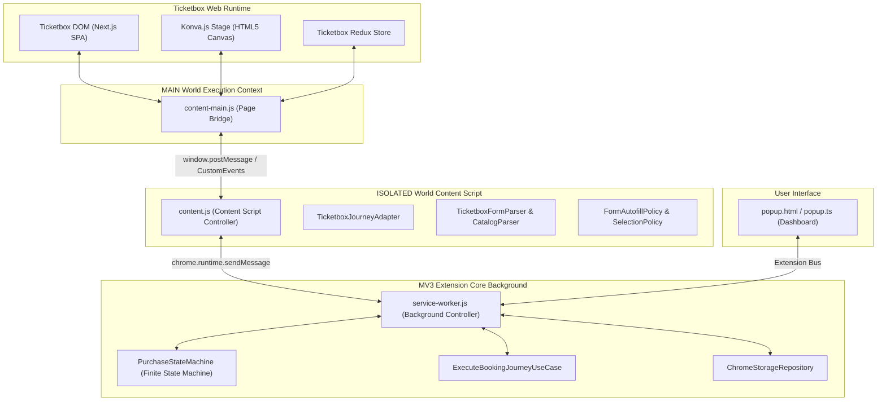
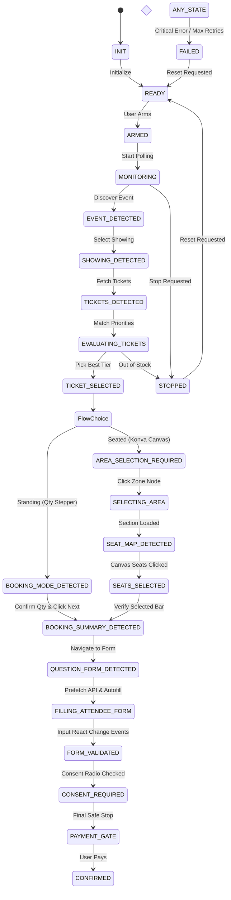
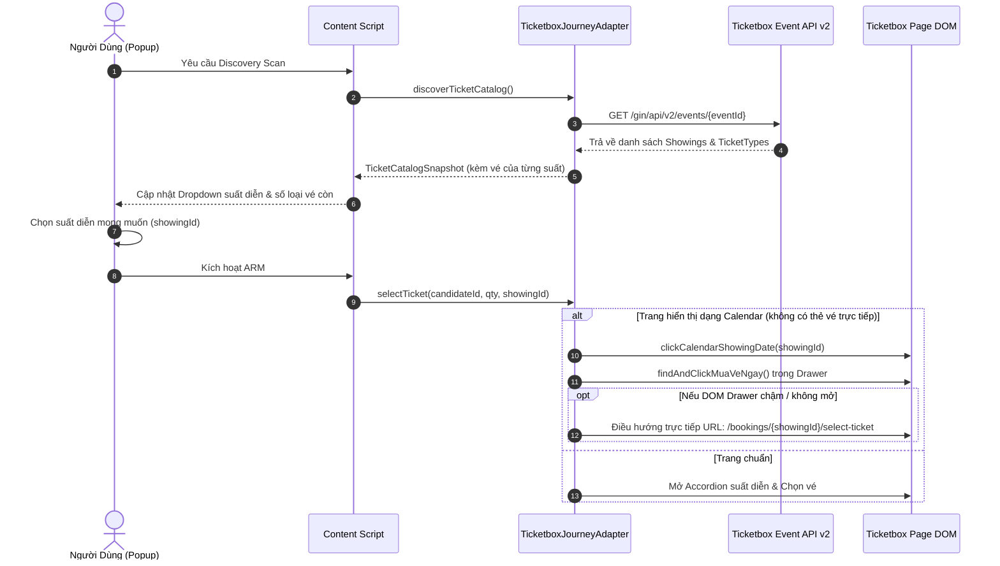
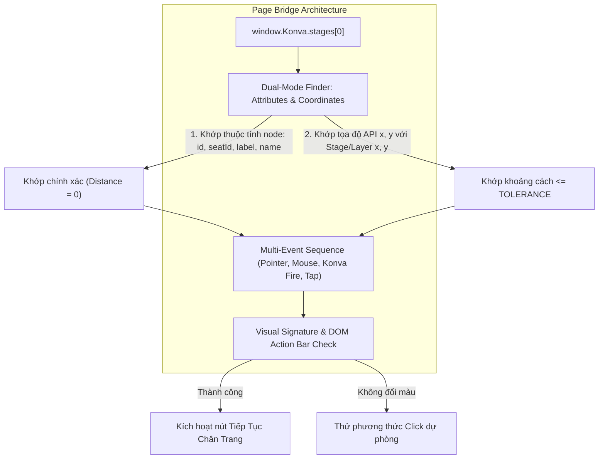
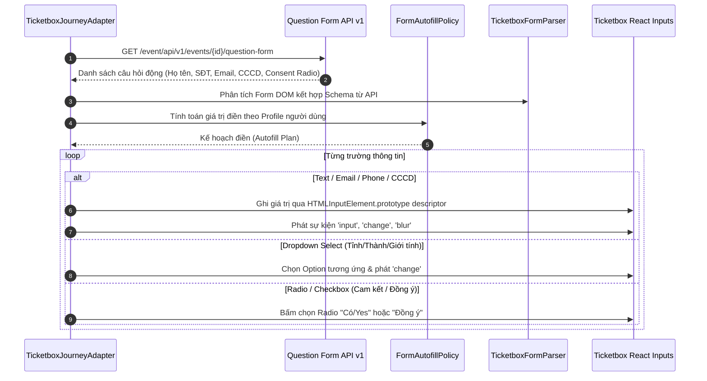

# Hướng Dẫn Kỹ Thuật Toàn Diện & Vận Hành Hệ Thống

**Tài liệu:** `docs/ticketbox/21-detailed-system-and-operation-guide.md`  
**Dự án:** Ticketbox Purchase Assistant  
**Phiên bản:** 0.3.0 (Phase 8 Production Hardened)  
**Ngày cập nhật:** 29/09/2026  
**Công nghệ:** Manifest V3 Chrome Extension, TypeScript, Vite, Konva.js v9.3.11 (HTML5 Canvas), React / Next.js SPA, Vitest.

---

## Mục Lục

1. [Tổng Quan Dự Án & Triết Lý Thiết Kế](#1-tổng-quan-dự-án--triết-lý-thiết-kế)
2. [Kiến Trúc Phân Tầng Manifest V3 & Clean Architecture](#2-kiến-trúc-phân-tầng-manifest-v3--clean-architecture)
3. [Máy Trạng Thái & Quản Lý Vòng Đời (State Machine)](#3-máy-trạng-thái--quản-lý-vòng-đời-state-machine)
4. [Các Hành Trình Đặt Vé Đầu Cuối (End-to-End Journeys)](#4-các-hành-trình-đặt-vé-đầu-cuối-end-to-end-journeys)
5. [Cơ Chế Multi-Showing & Lựa Chọn Suất Diễn (Event API v2)](#5-cơ-chế-multi-showing--lựa-chọn-suất-diễn-event-api-v2)
6. [Giải Mã & Điều Khiển Sơ Đồ Ghế Konva Canvas (Seated Flow)](#6-giải-mã--điều-khiển-sơ-đồ-ghế-konva-canvas-seated-flow)
7. [Bộ Điền Biểu Mẫu Người Tham Dự Tự Động (Question Form Autofill)](#7-bộ-điền-biểu-mẫu-người-tham-dự-tự-động-question-form-autofill)
8. [Đặc Tả Bằng Chứng API Mạng (Authoritative Network Evidence)](#8-đặc-tả-bằng-chứng-api-mạng-authoritative-network-evidence)
9. [Hướng Dẫn Cài Đặt & Vận Hành Cho Người Dùng](#9-hướng-dẫn-cài-đặt--vận-hành-cho-người-dùng)
10. [Hướng Dẫn Chẩn Đoán Lỗi & Troubleshooting](#10-hướng-dẫn-chẩn-đoán-lỗi--troubleshooting)

---

## 1. Tổng Quan Dự Án & Triết Lý Thiết Kế

**Ticketbox Purchase Assistant** là tiện ích mở rộng trình duyệt chuyên nghiệp được phát triển để hỗ trợ người dùng mua vé nhanh chóng, an toàn và chính xác trên nền tảng **Ticketbox (ticketbox.vn)**. Khác biệt hoàn toàn với các script clicker tự do hoặc bot spam thiếu kiểm soát, hệ thống hoạt động trên nguyên tắc **hướng miền (Domain-Driven Design)** với bằng chứng kỹ thuật xác thực từ máy chủ.

### 4 Nguyên Tắc Bất Biến (Non-Negotiable Boundaries)

```text
┌────────────────────────────────────────────────────────────────────────┐
│ 1. ZERO-CREDENTIAL PERSISTENCE                                         │
│    Tuyệt đối không lưu mật khẩu, OTP, mã CVV/CVC, token bảo mật hay   │
│    cookie nhạy cảm vào bất kỳ tầng lưu trữ nào.                       │
├────────────────────────────────────────────────────────────────────────┤
│ 2. AUTHORITATIVE SERVER EVIDENCE                                       │
│    Chỉ chuyển trạng thái khi có bằng chứng máy chủ (API / DOM xác      │
│    thực). Không tự suy đoán kết quả đặt chỗ khi chưa có phản hồi.      │
├────────────────────────────────────────────────────────────────────────┤
│ 3. HUMAN PAYMENT GATE BOUNDARY                                         │
│    Hệ thống luôn dừng lại ngay trước ngưỡng thanh toán (Payment Gate).  │
│    Việc thanh toán tiền là quyết định tài chính bắt buộc của con người.│
├────────────────────────────────────────────────────────────────────────┤
│ 4. PASSIVE-FIRST DISCOVERY                                             │
│    Quét danh mục vé, lịch diễn, giá cả thụ động. Tuyệt đối không       │
│    thực hiện DOM mutation hay gửi request mua khi chỉ đang quét.       │
└────────────────────────────────────────────────────────────────────────┘
```

---

## 2. Kiến Trúc Phân Tầng Manifest V3 & Clean Architecture

Hệ thống tuân thủ mô hình **Clean Architecture / Hexagonal Ports & Adapters** và chuẩn bảo mật nghiêm ngặt của Chrome Extension Manifest V3:



### Các Thế Giới Thực Thi (Execution Worlds)

1. **MAIN World (`content-main.js / page-bridge.ts`):** Chạy chung ngữ cảnh JavaScript với trang web Ticketbox. Có quyền truy cập biến toàn cục `window.Konva`, các đối tượng `Stage`, `Layer`, `Node`, và lắng nghe các sự kiện đồ họa canvas.
2. **ISOLATED World (`content.js`):** Chạy trong không gian bộ nhớ cách ly của extension. Thực hiện DOM parsing, điều khiển luồng kịch bản, và gửi thông điệp mã hoá lên background.
3. **Background Service Worker (`service-worker.ts`):** Đóng vai trò bộ não điều phối trung tâm. Duy trì vòng đời `PurchaseStateMachine`, điều phối multi-account profile, và ghi nhận nhật ký hoạt động.
4. **Popup UI (`popup.ts`):** Bảng điều khiển người dùng trực quan, cho phép nạp dữ liệu, chọn suất diễn, chọn thứ tự ưu tiên các loại vé, nhập thông tin người tham dự, và kích hoạt trạng thái "ARMED".

---

## 3. Máy Trạng Thái & Quản Lý Vòng Đời (State Machine)

`PurchaseStateMachine` kiểm soát toàn bộ chu trình với hơn 20 trạng thái nghiêm ngặt, ngăn chặn triệt để tình trạng click lặp, spam request hoặc treo luồng:



### Cơ Chế Tái Lập (Re-arm & Reset) Khi Thử Lại

Khi người dùng bấm hủy (`STOP`) hoặc đổi cấu hình và bấm `ARM` lại:

- State Machine chủ động chuyển qua `STOP_REQUESTED` $\rightarrow$ `RESET_REQUESTED` $\rightarrow$ `ARM` $\rightarrow$ `MONITORING_STARTED`.
- Tránh vướng lỗi kẹt trạng thái cũ (`Invalid transition from ...`).
- Cơ chế **Retry-Storm Guard**: Nếu quá số lần retry cho phép và rơi vào `FAILED`, vòng lặp theo dõi tự động tắt hoàn toàn để bảo vệ tài khoản và tránh tắc nghẽn mạng.

---

## 4. Các Hành Trình Đặt Vé Đầu Cuối (End-to-End Journeys)

Hệ thống hỗ trợ 3 kịch bản chính:

### Luồng 1: Vé Đứng / Không Chia Ghế (Standing Flow)

1. **Dò quét:** Đọc danh sách vé từ landing page.
2. **Chọn hạng vé:** Khớp tên vé theo danh sách ưu tiên cấu hình.
3. **Chọn số lượng:** Tăng số lượng theo đúng cấu hình bằng cách click nút `+` (stepper).
4. **Bấm tiếp tục:** Kích hoạt nút `Mua ngay / Tiếp tục >>`.
5. **Điền form:** Tự động điền biểu mẫu người tham dự.
6. **Dừng an toàn:** Dừng tại cổng chọn phương thức thanh toán.

### Luồng 2: Sự Kiện Nhiều Suất Diễn / Lịch Diễn (Calendar & Multi-Showing Flow)

_(Chi tiết tại [Mục 5](#5-cơ-chế-multi-showing--lựa-chọn-suất-diễn-event-api-v2))_

### Luồng 3: Vé Ngồi Có Sơ Đồ Ghế Đồ Họa Konva Canvas (Seated Flow)

_(Chi tiết tại [Mục 6](#6-giải-mã--điều-khiển-sơ-đồ-ghế-konva-canvas-seated-flow))_

---

## 5. Cơ Chế Multi-Showing & Lựa Chọn Suất Diễn (Event API v2)

Đối với các sự kiện nghệ thuật, concert dài ngày (ví dụ: _Eifman Ballet_ hoặc các tour lưu diễn), mỗi ngày/giờ diễn là một **Showing** riêng biệt với tập danh mục vé và ID hoàn toàn khác nhau.



### Điểm Vượt Trội Của Giải Pháp:

- **Autoritative Prefetch:** Gọi trực tiếp `https://api-v2.ticketbox.vn/gin/api/v2/events/{eventId}` để nắm chắc ID vé của từng buổi diễn.
- **Fail-Safe Direct Navigation:** Nếu giao diện lịch diễn (Calendar) gặp hiệu ứng drawer chậm hoặc bị che phủ, hệ thống sẽ kích hoạt chuyển hướng URL chuẩn `/bookings/{showingId}/select-ticket` ngay lập tức, tiết kiệm từng mili-giây quý giá.

---

## 6. Giải Mã & Điều Khiển Sơ Đồ Ghế Konva Canvas (Seated Flow)

Ticketbox không sử dụng phần tử HTML hay SVG thông thường cho ghế ngồi, mà vẽ toàn bộ sơ đồ lên thẻ `<canvas>` bằng thư viện **Konva.js v9.3.11**. Để tương tác chính xác, hệ thống triển khai cầu nối **Page Bridge** chạy trực tiếp trong `MAIN World`.



### Thuật Toán Khớp Ghế Kép (Dual-Mode Seat Matching)

1. **Khớp Thuộc Tính Trực Tiếp (Direct Attributes):**
   - Đọc các thuộc tính trên đối tượng Konva Node: `attrs.id`, `attrs.seatId`, `attrs['data-seat-id']`, `attrs.name`, `attrs.label`.
   - Nếu trùng khớp với thông tin ghế mục tiêu, chọn ngay với khoảng cách ưu tiên tuyệt đối (`distance = 0`).
2. **Khớp Toạ Độ Hình Học (Coordinate Matching with Tolerance):**
   - Tính toán khoảng cách Euclid giữa toạ độ API `(seat.x, seat.y)` với toạ độ cục bộ và toạ độ tuyệt đối (`node.getAbsolutePosition()`).
   - Lọc các node hình tròn (`Konva.Circle`) hoặc khối hình (`Konva.Shape`) nằm trong phạm vi sai số cho phép (`SEAT_MATCH_TOLERANCE = 1.0`).
3. **Phát Chuỗi Sự Kiện Toàn Diện (Multi-Event Dispatching):**
   - `pointerdown` $\rightarrow$ `pointerup`
   - `mousedown` $\rightarrow$ `mouseup` $\rightarrow$ `click`
   - `node.fire('click')` & `node.fire('tap')`
   - Kiểm tra thanh hiển thị ghế ở chân trang (`checkout-bar`, `booking-bar`) để xác nhận ghế đã được hệ thống Ticketbox ghi nhận.

---

## 7. Bộ Điền Biểu Mẫu Người Tham Dự Tự Động (Question Form Autofill)

Tại bước thanh toán, Ticketbox thường yêu cầu điền thông tin người tham dự thông qua biểu mẫu động (`/question-form`).



### Các Trường Thông Tin Được Hỗ Trợ:

| Trường Thông Tin       | Nhãn Nhận Diện Thông Minh                 | Kiểu Input       | Dữ Liệu Nguồn Cấu Hình               |
| :--------------------- | :---------------------------------------- | :--------------- | :----------------------------------- |
| **Họ và Tên**          | _Họ và tên, Full name, Tên người nhận_    | `TEXT`           | `userProfile.fullName`               |
| **Số Điện Thoại**      | _Số điện thoại, Phone, Mobile_            | `PHONE`          | `userProfile.phone`                  |
| **Email**              | _Email, Địa chỉ email nhận vé_            | `EMAIL`          | `userProfile.email`                  |
| **Số CCCD / Hộ Chiếu** | _CCCD, CMND, Hộ chiếu, Passport, ID Card_ | `ID_CARD`        | `userProfile.idCard`                 |
| **Năm Sinh**           | _Năm sinh, Ngày sinh, Birth year, YOB_    | `BIRTH_YEAR`     | `userProfile.birthYear`              |
| **Giới Tính**          | _Giới tính, Gender, Nam/Nữ_               | `SELECT/RADIO`   | `userProfile.gender`                 |
| **Địa Chỉ**            | _Địa chỉ, Address, Tỉnh/Thành phố_        | `ADDRESS`        | `userProfile.address`                |
| **Thoả Thuận Đồng Ý**  | _Tôi đồng ý..., I agree..., Cam kết..._   | `RADIO/CHECKBOX` | Tự động chọn `"Có/Yes"` / `"Đồng ý"` |

---

## 8. Đặc Tả Bằng Chứng API Mạng (Authoritative Network Evidence)

### 1. Authoritative Event API v2

- **Endpoint:** `GET https://api-v2.ticketbox.vn/gin/api/v2/events/{eventId}`
- **Công dụng:** Đọc toàn bộ danh sách suất diễn, trạng thái bán vé (`isSalable`), và danh mục vé của từng suất diễn.
- **Trích đoạn dữ liệu mẫu:**
  ```json
  {
    "status": 1,
    "message": "Thành công",
    "data": {
      "result": {
        "id": 26215,
        "title": "Eifman Ballet Of ST. Petersburg",
        "showings": [
          {
            "id": 14970,
            "status": "salable",
            "isSalable": true,
            "showingTime": "19:30 15/10/2026",
            "ticketTypes": [
              {
                "id": 105820,
                "name": "VIP 1",
                "price": 2500000,
                "status": "book_now",
                "minQtyPerOrder": 1,
                "maxQtyPerOrder": 4
              }
            ]
          }
        ]
      }
    }
  }
  ```

### 2. Authoritative Seatmap API v1

- **Endpoint:** `GET https://api-v2.ticketbox.vn/event/api/v1/events/showings/{showingId}/seatmap`
- **Công dụng:** Lấy danh sách các phân khu (`zones`), khu vực (`sections`), và chi tiết toạ độ từng ghế ngồi (`x`, `y`, `row`, `col`, `status`).

### 3. Authoritative Question Form API v1

- **Endpoint:** `GET https://api-v2.ticketbox.vn/event/api/v1/events/{eventId}/question-form`
- **Công dụng:** Đọc trước danh sách câu hỏi động của ban tổ chức trước khi chuyển sang trang checkout.
- **Trích đoạn dữ liệu mẫu:**
  ```json
  {
    "status": 1,
    "data": {
      "result": {
        "id": 14970,
        "eventId": 26215,
        "questionCollection": [
          {
            "type": 2,
            "question": "Tôi đồng ý Ticketbox & BTC sử dụng thông tin đặt vé...",
            "isAnswerRequired": true,
            "options": [{ "optionText": "Có/Yes" }]
          }
        ]
      }
    }
  }
  ```

---

## 9. Hướng Dẫn Cài Đặt & Vận Hành Cho Người Dùng

### Bước 1: Build Extension Từ Mã Nguồn

Mở terminal trong thư mục dự án và chạy:

```bash
# Cài đặt thư viện nếu chưa có
npm install

# Kiểm tra chất lượng và chạy bộ test (245 tests pass)
npm test

# Đóng gói bản build ra thư mục dist/
npm run build
```

### Bước 2: Nạp Extension Vào Trình Duyệt Chrome

1. Mở Google Chrome và truy cập địa chỉ: `chrome://extensions/`.
2. Bật công tắc **"Developer mode" (Chế độ cho nhà phát triển)** ở góc trên bên phải.
3. Bấm nút **"Load unpacked" (Tải tiện ích đã giải nén)** ở góc trên bên trái.
4. Điều hướng và chọn thư mục `d:\ticket_tool\dist`.
5. Đảm bảo extension **"Ticketbox Purchase Assistant"** đã hiển thị với trạng thái kích hoạt.

### Bước 3: Cấu Hình Trong Giao Diện Popup

1. Mở trang sự kiện Ticketbox muốn mua (ví dụ: `https://ticketbox.vn/eifman-ballet-petersburg-ho-chi-minh-26215`).
2. Bấm vào biểu tượng extension trên thanh công cụ của Chrome để mở Popup:
   - **Chọn Suất Diễn (Showing):** Nếu sự kiện có nhiều ngày/giờ, chọn suất diễn bạn muốn tham dự. Danh sách hiển thị trực quan số loại vé còn trống.
   - **Chọn Hạng Vé (Ticket Tier) & Số Lượng:** Chọn hạng vé bạn ưu tiên hàng đầu (ví dụ: `VIP 1` hoặc `VIP 2`). Bổ sung thêm các hạng vé dự phòng nếu muốn. Thiết lập số lượng vé (Quantity).
   - **Nhập Thông Tin Người Mua / Tham Dự (Attendee Profile):**
     - Họ và tên (Full Name)
     - Số điện thoại (Phone)
     - Email nhận vé
     - Số CCCD / Hộ chiếu (Bắt buộc cho các concert/sự kiện lớn)
     - Năm sinh (ví dụ: `1998`)
     - Giới tính (Nam / Nữ)
     - Địa chỉ liên hệ
3. Nhấn **"Lưu kế hoạch"** hoặc thông tin sẽ được tự động lưu vào storage cục bộ.

### Bước 4: Cấu Hình Ma Trận Săn Vé Có Phạm Vi (Scoped Purchase Matrix)

1. Mở Popup extension trên trang sự kiện Ticketbox. Hệ thống tự động thu thập danh sách Suất diễn và các Hạng vé (Event API v2).
2. Tại khu vực **"🎯 SĂN VÉ CÓ PHẠM VI (SCOPED MATRIX)"**:
   - Nhập thứ tự ưu tiên (**Rank**: 1, 2, 3...) cho từng suất diễn.
   - **Tick chọn các hạng vé được phép mua** trong từng suất.
   - Chọn **Số lượng vé** cần mua (hệ thống tự động kiểm tra trần `maxQtyPerOrder` của từng hạng).
   - Chọn **Chiến lược ưu tiên**:
     - _Theo thứ tự mục tiêu (Rank)_ (Mặc định).
     - _Ưu tiên suất diễn trước_.
     - _Ưu tiên hạng vé trước_.
   - Mở mục **"Thông số kiên trì"** để điều chỉnh trần thời gian (mặc định 120 phút, trần cứng 240), trần số lần thử (mặc định 1000 lần, trần cứng 5000), giãn cách poll (mặc định 2000ms, sàn tối thiểu 1500ms) và tỷ lệ jitter (0.2).
3. Đọc kỹ bản tóm tắt tại hộp **"XÁC NHẬN PHẠM VI MUA VÉ"**:
   - `Sẽ chỉ mua:` Danh sách các cặp Suất diễn × Hạng vé bạn đã tick.
   - `Sẽ KHÔNG mua:` Mọi suất diễn hoặc hạng vé còn lại.
   - **Tick chọn ô xác nhận** trước khi bấm ARM.
4. Bấm **"ARM ASSISTANT"**:
   - Nếu danh sách whitelist rỗng hoặc cấu hình vi phạm quy tắc (pollInterval < 1500ms, số lượng vượt trần), hệ thống sẽ chặn ARM và hiển thị thông báo lỗi cụ thể.

### Bước 5: Khởi Chạy Săn Vé Tự Động

1. Đảm bảo tab trang Ticketbox đang mở và đã đăng nhập tài khoản Ticketbox của bạn.
2. Trên giao diện Popup, bấm nút **"ARM ASSISTANT"** (đã qua bước xác nhận ma trận).
3. Hệ thống sẽ:
   - Tự động dò tìm vé theo đúng danh sách whitelist.
   - Tuyệt đối không chọn vé ngoài whitelist (dù vé ngoài whitelist có sẵn và vé whitelist hết hàng).
   - Nếu là sự kiện lịch diễn, tự động click ngày và mở luồng đặt vé.
   - Nếu là vé ngồi, tự động chọn khu vực và chọn đúng vị trí ghế trống.
   - Tự động điền đầy đủ biểu mẫu người tham dự và đồng ý các điều khoản.
   - Dừng lại tại trang thanh toán (`PAYMENT_GATE`) và phát chuông/thông báo để bạn chọn ngân hàng và hoàn tất tiền vé.

---

## 10. Hướng Dẫn Chẩn Đoán Lỗi & Troubleshooting

### 1. Làm Thế Nào Để Xem Nhật Ký Chi Tiết?

- Trên tab Ticketbox, nhấn `F12` $\rightarrow$ Chọn tab **Console**.
- Các thông điệp được phân loại rõ ràng:
  - `[CONTENT_SCRIPT]`: Nhật ký quét trang, nhận diện trạng thái và điều phối hành trình.
  - `[PAGE_BRIDGE]`: Nhật ký tương tác trực tiếp với Canvas và Konva.js.
  - `[STATE_MACHINE]`: Nhật ký chuyển trạng thái thời gian thực.

### 2. Sự Cố Thường Gặp & Cách Khắc Phục:

- **Hiện tượng:** Click nút ARM nhưng không thấy phản ứng.
  - _Khắc phục:_ Nhấn `F5` tải lại trang Ticketbox và nhấn biểu tượng Refresh (Nạp lại) của extension trong `chrome://extensions/` để đảm bảo code mới nhất được nạp.
- **Hiện tượng:** Ghế trên sơ đồ không được chọn.
  - _Khắc phục:_ Kiểm tra xem hạng vé đó có còn ghế trống hay đã bán hết. Nếu khu vực đó đã hết ghế, hệ thống sẽ tự động tìm kiếm các hạng vé dự phòng bạn đã cấu hình.
- **Hiện tượng:** Form thông tin không điền đủ trường.
  - _Khắc phục:_ Mở Popup extension, kiểm tra mục **"Thông tin người mua / tham dự"** xem đã điền đầy đủ CCCD, năm sinh và giới tính chưa.

---

_Tài liệu được biên soạn và bảo chứng bởi quy chuẩn kỹ thuật `docs/ticketbox/12-ai-engineering-rules.md`._
